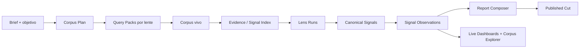

# 21 · Noisia Live Intelligence Plan

> Estado: plan oficial de arquitectura y producto. Este documento reemplaza la idea de
> "reporte como foto de JSON" por un sistema de inteligencia vivo: corpus persistente,
> señales canónicas, observaciones históricas, lentes metodológicos y cortes publicados
> auditables.

## 0. Principio central

El reporte publicado no es la base de datos.

- **Source of truth:** corpus vivo + codificaciones + señales persistidas en Postgres.
- **Published Signal:** corte editorial congelado, client-safe y auditable.
- **Live Intelligence:** dashboards, Corpus Explorer e históricos conectados a datos vivos
  con permisos y ventanas de acceso.

T&B actual queda protegido. Lo nuevo se construye de forma aditiva y con feature flags.

## 1. Problema que resolvemos

Hoy Noisia ya persiste análisis (`tb_analyses`, `tb_findings`, `tb_mention_codings`,
`tb_finding_citations`) y publica una foto en `published_outputs.payload`. Esa foto sirve
para auditoría, pero no para un negocio mensual:

- los charts no filtran por fecha de forma real;
- el Corpus View muestra muestras acotadas en vez del corpus consultable;
- un finding de mayo puede desaparecer en junio sin memoria;
- los IDs de findings pertenecen al run, no a una señal persistente;
- volver a correr un reporte puede renombrar, mover o perder insights.

La solución es separar **señal canónica** de **observación por corte**.

## 2. Modelo mental



## 3. Capas del sistema

### 3.1 Corpus Plan

Define qué necesita el estudio antes de pedir datos caros. Un estudio no se aprueba en
abstracto: se aprueba por lente, intención y scope.

Ejemplo:

| Lens | Intent | Scope | Required |
| --- | --- | --- | --- |
| T&B | triggers | brand | yes |
| T&B | barriers | competitors | yes |
| VPM | monetary_cost | category | yes |
| JFM | checkout_friction | brand | optional |
| Cultural Codes | identity_tension | category | directional |

### 3.2 Query Packs

Cada pack tiene objetivo, seeds, query, scope, evaluación y presupuesto. Ya no existe una
sola query que pretende servir para todas las metodologías.

Campos mínimos:

- `lens_slug`
- `signal_intent`
- `scope`
- `objective`
- `query_text`
- `seeds`
- `evaluation`
- `status`
- `cost_budget`

### 3.3 Corpus Vivo Con Provenance

Cada mención conserva de dónde vino y para qué sirve. Una mención puede alimentar varios
lentes sin duplicarse.

Campos mínimos de provenance:

- `mention_id`
- `query_pack_id`
- `lens_slug`
- `signal_intent`
- `scope`
- `entity_id`
- `match_quality`

### 3.4 Evidence / Signal Index

Procesamiento barato y reutilizable:

- dedup;
- idioma, país y calidad;
- entity attribution;
- embeddings;
- keywords/TF-IDF;
- clusters/topics;
- sentimiento;
- fuente y periodo.

Esta capa evita que cada metodología relea todo el corpus con Claude.

### 3.5 Lens Runs

Las metodologías son lentes que consumen corpus + index + query packs. No son reportes
aislados.

- T&B produce triggers/barriers.
- VPM produce valor/costo.
- JFM produce fricciones.
- Cultural Codes produce códigos/tensiones.
- Competitive Wave produce posición comparativa.

Todos los lentes escriben a la misma memoria persistente.

### 3.6 Canonical Signals

Una señal canónica es un insight persistente de marca/categoría. Puede aparecer, crecer,
perder fuerza, dormir y volver.

Ejemplo:

> "Querer ser reconocido por tener un auto del año"

No debe morir si en el siguiente corte tiene menos volumen. Debe pasar a `fading`,
`dormant` o `recurring` según sus observaciones.

### 3.7 Signal Observations

Cada corte mensual crea observaciones sobre señales canónicas.

Una observación guarda:

- ventana temporal;
- frecuencia;
- share;
- intensidad;
- sentimiento;
- confianza;
- ranking;
- delta contra el periodo anterior;
- citas/evidencia de ese corte.

### 3.8 Published Cut

El reporte publicado sigue existiendo como snapshot. Guarda:

- narrativa editorial;
- configuración de módulos;
- IDs de señales/observaciones usadas;
- manifest de demo/blur;
- fecha y autor de publicación.

No debe cargar miles de menciones dentro del JSON.

### 3.9 Live Signal

El dashboard final puede leer datos vivos mediante APIs seguras:

- búsqueda paginada del corpus;
- filtros por fecha/fuente/entidad/lente/finding;
- historical charting;
- evidence drawers;
- timelines de señales;
- módulos comparativos.

## 4. Tablas nuevas

### 4.1 `query_packs`

Plan y evaluación de queries por lente/intención/scope.

### 4.2 `mention_query_sources`

Relación many-to-many entre menciones y packs. Permite provenance sin duplicar menciones.

### 4.3 `canonical_signals`

Memoria persistente de señales por brand/theme/categoría y metodología.

### 4.4 `signal_observations`

Medición de una señal canónica en una ventana temporal.

### 4.5 `signal_observation_evidence`

Citas y fuentes que sostienen una observación.

## 5. API y producto

### 5.1 Corpus Explorer real

Endpoint paginado, filtrable y permission-scoped. El cliente consulta el corpus permitido,
no una muestra fija.

Filtros esperados:

- búsqueda textual;
- fecha;
- plataforma;
- content type;
- entidad;
- lente;
- signal intent;
- signal/canonical signal;
- finding;
- sentimiento;
- confidence;
- query pack;
- país/idioma.

### 5.2 Historical Overview

Primer objetivo: T&B solamente.

El overview debe responder:

- cuándo apareció una señal;
- cuándo creció o cayó;
- qué evento/cita la sostiene;
- si la señal está activa, emergente, fading, dormant o recurring;
- cómo cambia por entidad, fuente o periodo.

### 5.3 Composer Multimétodo

El composer arma reportes desde señales persistidas y observaciones:

- módulos elegidos;
- findings deduplicados;
- evidencia cruzada;
- oportunidades/riesgos como capa final;
- narrative snapshot;
- charts vivos.

## 6. Reglas anti-romper

- Migraciones aditivas, idempotentes y con rollback lógico.
- Feature flags por fase.
- Workers para todo lo pesado.
- Studio nunca ejecuta queries largas ni análisis costosos.
- `published_outputs.payload` se mantiene como fallback.
- Shadow mode antes de enseñar al cliente.
- Golden corpora para QA: Telefonía, Sephora, First Direct.
- Cost ledger por job: modelo, tokens, duración, costo estimado.
- Si Live falla, Signal snapshot viejo sigue funcionando.

## 7. Orden real de construcción

1. Crear spec/doc oficial del plan.
2. Agregar tablas `query_packs`, `mention_query_sources`, `canonical_signals`,
   `signal_observations`, `signal_observation_evidence`.
3. Hacer Corpus Explorer real paginado desde DB.
4. Hacer historical overview para T&B solamente.
5. Conectar VPM/JFM/etc. al mismo modelo persistente.
6. Implementar composer multimétodo.
7. QA, build local y decisión de despliegue.

## 8. Estado operativo

> Actualizado: 2026-06-05. Este estado es intencionalmente conservador: distingue lo
> que ya compila en local de lo que todavía requiere migraciones, seeds y QA con DB real.

| Fase | Estado | Nota |
| --- | --- | --- |
| Spec oficial | Listo local | Este documento es la fuente de verdad del plan Live Intelligence. |
| Schema engine/live intelligence | Listo local | Migraciones `0025`, `0026`, `0027`, `0028` y `0029` existen y compilan en schema. |
| Guards runtime/costo | Listo local | `NOISIA_ENGINE_RUNTIME_ENABLED`, `NOISIA_ENGINE_LLM_ENABLED`, `NOISIA_ENGINE_ALLOW_OPUS`, `NOISIA_ENGINE_FIXTURE_CODING_ENABLED`, `NOISIA_SIGNAL_CHAT_LLM_ENABLED` y `NOISIA_SIGNAL_CHAT_ALLOW_OPUS` quedan cerrados por default. El runtime engine ya no acepta flags legacy como `FEATURE_ENGINE_LENSES`. `#11 Competitive T/B Matrix` queda seedable/publicable, pero no runnable como engine. |
| Query provenance | Listo local | CSV/import workers crean o enlazan `query_packs` y `mention_query_sources`. |
| Baseline reuse en outputs | Hardening local | Corpus Explorer, History y Composer consultan `study_corpus_id + base_corpus_id`. En engine, `preflight` cuenta entidades/import batches del baseline y `retrieve`/`code` preservan el `study_corpus_id` real de cada mención, para no perder provenance cuando el peer set vive en el corpus de industria. |
| Corpus Explorer real | Implementado y testeado local | Requiere migraciones aplicadas para operar contra DB real; si faltan tablas, cae al snapshot publicado. Query builder testeado para brand+baseline, paginación y filtros parametrizados. |
| Historical T&B | Implementado y testeado local | Requiere publicación/QA con DB migrada para validar señales y observaciones reales. Agrupación/timeline testeadas por señal y periodo; ahora deriva `emerging`, `rising`, `fading`, `dormant` y `recurring`, y expone una cita representativa por observación cuando existe. |
| Snapshot links | Implementado local | Al publicar T&B, el payload queda con `live_intelligence.finding_links` hacia `canonical_signal_id` y `signal_observation_id`, sin guardar corpus pesado dentro del JSON. |
| Engine snapshot links | Implementado local | Al publicar un output engine beta, las observaciones ya existentes se enlazan al `published_output_id` y el payload agrega `live_intelligence.finding_links` hacia memoria persistente. |
| Signal `brand_id = null` | Hardening local | Listado, detalle, deck y share de Signal usan `theme_id`/organización como fallback cuando un output de industria/theme no tiene marca. Los clientes ven themes de su organización; no se abre visibilidad global por `is_public`. |
| API pública `brand_id = null` | Hardening local | Reporting v1/v2 preserva el contrato `brand_name`, pero usa `themeName` cuando no hay marca ni `payload.report.brand_name`. Esto cubre datasets `summary` y metadata V2 para outputs de industria/theme. |
| Outputs baratos T&B | Implementado y testeado local | `#01 T&B Comparative Dashboard` y `#11 Competitive T&B Matrix` leen payload T&B existente; no requieren corrida engine. La API y workers rechazan `competitive-tb-matrix` como metodología runtime. En Signal son módulos publicables/blurreables independientes. |
| No-cost QA fixtures | Implementado local | `NOISIA_ENGINE_FIXTURE_CODING_ENABLED=true` permite codificación fixture determinística para todas las metodologías engine runnable; `#11 Competitive T/B Matrix` sigue output-only. Registra costo cero en ledger y limitación explícita. Sirve para validar pipeline local/staging sin Claude; no es síntesis client-ready. |
| Engine metodologías beta | Scoring beta listo local | Specs/registry/workers/payload genérico, previews de charts, scoring determinístico y quality gates existen para todas las metodologías beta. Siguen invisibles/beta y sin runtime activo por default. |
| Engine beta inventory | Implementado y testeado local | `GET /api/corpora/:id/engine-analysis` devuelve metodología, versión, status, `runnable` y `output_only`; el panel Studio muestra chips y bloquea métodos no seedados/output-only. `POST` sólo acepta metodologías seedadas en `beta`, además del runtime flag, y responde 503 controlado si el schema engine todavía no está migrado. Outputs engine publicados tienen módulo propio `Engine Methodology` en Signal, apagado por default para T&B normal. |
| Engine methodology view | Implementado y testeado local | Los outputs engine publican `engine_block.methodology_view` con readiness, cards, filas y conclusiones derivadas de dimensiones propias por lente. Narrative, VPM, JFM, Trust/Risk, Wave, Cultural Codes, Influence, Decision Velocity, etc. ya no quedan como lista genérica: cada uno expone su eje primario/secundario y limitaciones beta sin llamar LLM. |
| Engine deck slides | Implementado local | El deck de Signal detecta `engine_block.methodology_view` y agrega slides opcionales de lente metodológico, readiness, señales principales y conclusiones trazadas por `finding_id`. Si el output es T&B normal, el deck viejo no cambia. |
| Public API engine sections | Implementado y testeado local | Reporting V2 expone `engine-methodology` y `methodology-view` como secciones/alias, además del payload full. Esto permite consumir outputs engine beta sin conocer la estructura interna completa. OpenAPI incluye ambas secciones. |
| Engine launch guard | Implementado y testeado local | La validación de launch vive en helper puro: rechaza T&B, outputs read-only como `competitive-tb-matrix`, métodos no seedados y métodos no `beta` antes de crear snapshots o jobs. |
| Cost ledger engine | Implementado local | `engine_cost_events` registra provider/model/tokens/costo estimado por análisis y step. `engine_step_code` registra skips y batches; no activa runtime ni llamadas caras. |
| Cost ledger UI | Implementado local | El panel Engine beta muestra eventos, tokens, costo estimado y providers de la última corrida para distinguir fixture/skips/LLM sin entrar a logs. |
| Narrative Ownership | Beta técnica testeada | Tiene fixture, contrato de prompt JSON-first, scoring determinístico de ownership/share/diferencial por narrativa y quality gates específicos. Falta QA end-to-end con corpus real pequeño. |
| Sentiment / Advocacy Proxy | Beta técnica testeada | Calcula `advocacy_proxy`, `% promoter`, `% detractor`, driver share e `is_survey_nps=false` de forma determinística por entidad. Falta QA con corpus real y diseño final del bloque. |
| Trust & Risk Benchmark | Beta técnica testeada | Calcula `trust_score`, `risk_score`, severidad/escalada y vulnerabilidad reputacional; gates bloquean riesgos sensibles sin cita. Falta QA con corpus real y diseño final del bloque. |
| VPM | Beta técnica testeada | Calcula ownership de celda beneficio/costo, `value_score`, diferencial y marca whitespace sólo como candidato hasta probar ausencia. Falta QA con corpus real y diseño final del bloque. |
| JFM | Beta técnica testeada | Calcula `choke_score`, `accelerator_score`, share por fase/tipo y removibilidad heurística marcada como direccional. Falta QA con corpus real y diseño final del bloque. |
| Category Opportunity | Beta técnica testeada | Calcula demanda, cobertura, urgencia, `opportunity_score` y mejor entidad posicionada desde share/sentimiento. Gates exigen evidencia de cobertura. Falta QA con baseline real. |
| White Space | Beta técnica testeada | Calcula demanda, cobertura competitiva, permiso de marca, `whitespace_score` y clasificación capturable/aspiracional/defend. Gates separan score de evidencia real de ausencia. |
| Brand Positioning | Beta técnica testeada | Calcula coordenadas perceptuales x/y, score de atributo, distancia a entidad más cercana y exige ejes definidos/múltiples entidades. Falta UI final del mapa. |
| Cultural Codes | Beta técnica testeada | Calcula intensidad cultural, ownership, tensión y madurez, pero gates bloquean niveles profundos sin validación de texto largo. Falta preflight de fuentes largas. |
| Competitive Wave | Beta técnica testeada | Calcula ejes normalizados, `wave_x`, `wave_y`, zona y publishability; gates exigen mínimo tres entidades. Falta diseño final/interacción de Wave. |
| Audience Segment Lens | Beta técnica testeada | Calcula matriz segmento×entidad, metric value y `segment_skew`; gates bloquean falta de fuente de segmento o inferencia sensible. |
| Influence Architecture | Beta direccional testeada | Calcula influence score desde señales codificadas, pero marca explícitamente que falta metadata de autores/grafo; gates bloquean publicación real sin centralidad. |
| Decision Velocity | Beta direccional testeada | Calcula blockers/accelerators y `velocity_index` inferido por fase; gates exigen benchmark e hipótesis A/B antes de publicación real. |
| Composer multimétodo | Base testeada local | API/componentes existen; `Live Composer` ya es módulo publicable/blurreable en el manifest, con navegación propia en Signal. Deduplica oportunidades/riesgos, conserva `supporting_signal_ids`/`supporting_observation_ids`, expone citas representativas desde `signal_observation_evidence` y permite filtrar por metodología, tipo de señal y status. No recalcula ni lanza jobs. Falta QA con observaciones reales y diseño final de módulos. |
| Composer draft manifest | Implementado y testeado local | El endpoint del composer devuelve `draft.kind=live_composer_draft` con módulos, señales deduplicadas, oportunidades, riesgos, observaciones y menciones de evidencia. Todavía no persiste selección editorial; deja listo el contrato para guardado/aprobación sin recalcular. |
| Outputs baratos T&B | Implementado local | `#01 T&B Comparative Dashboard` y `#11 Competitive T&B Matrix` se construyen desde `comparative_brief` T&B, no corren engine nuevo, y ahora son módulos publicables/blurreables independientes en Signal. |
| Deck live traceability | Implementado local | El deck sigue siendo snapshot congelado, pero si el payload tiene `live_intelligence` muestra un indicador discreto de señales/observaciones/evidencia en Quality & Boundaries. |
| Signal Chat live evidence | Hardening local | La recuperación semántica ahora usa `published_outputs + study_corpora`, incluye `base_corpus_id`, prefiere evidencia viva ligada por `signal_observations.published_output_id` y cae al snapshot T&B legacy si el schema live no existe. LLM sigue apagado por default. |
| Seed remoto safety | Implementado y testeado local | `db:seed` y `db:seed:methodologies` rechazan DB no local por default. Para una DB remota aislada/staging exigen `NOISIA_DB_SEED_ALLOW_REMOTE=true`; readiness confirma que el default documentado sigue apagado. |
| Backfill/republish safety | Implementado local | Los scripts de republish preservan el bloque `live_intelligence` existente y `--embeddings --apply` no agenda embeddings salvo `--allow-costly` más `NOISIA_ALLOW_COSTLY_BACKFILL=true`. |
| Readiness sin DB | Implementado y testeado local | `pnpm db:verify:readiness` valida sin conectar a DB que existan migraciones `0025`-`0029` en archivos y journal, que los 15 YAML beta esperados estén presentes y que `.env.example` mantenga flags caros apagados por default. |
| DB smoke reproducible | Implementado local | Existe `pnpm db:smoke:migrations` y `pnpm db:smoke:local`; sólo corren contra DB local por default, soportan `DATABASE_SSL=false` y verifican tablas/índices live intelligence después de aplicar todas las migraciones. `db:smoke:local` levanta `postgres-smoke` con `pgvector` en Docker. |
| Prod readiness | No listo | Falta aplicar migraciones/seeds en ambiente elegido, correr `db:verify` y smoke test con DB real/staging. |

## 9. Runbook seguro antes de QA/prod

### 9.1 Verificación local obligatoria

Estos comandos deben pasar antes de tocar una DB compartida:

```bash
pnpm --filter @noisia/query-engine test
pnpm --filter @noisia/studio test
pnpm --filter @noisia/workers test
pnpm --filter @noisia/db test
pnpm db:verify:readiness
pnpm --filter @noisia/query-engine typecheck
pnpm --filter @noisia/studio typecheck
pnpm --filter @noisia/workers typecheck
pnpm --filter @noisia/db typecheck
pnpm test
pnpm build
git diff --check
```

Estado actual local: todos pasan.

Evidencia actual local:

- Studio tests: 56 passing (`public API`, API pública con fallback theme para reportes sin marca, secciones públicas engine/methodology-view, inventario de metodologías engine beta, launch guards de runtime beta, Corpus Explorer live query builder, Historical T&B grouping/timeline/trend status/evidence quote, T&B canonical observations, idempotencia sin snapshot, links snapshot→memoria, engine snapshot→memoria, enriquecimiento del payload publicado sin mutarlo, Signal theme fallback para reportes sin marca, composer con selección/dedupe/evidencia multimétodo, draft manifest del composer, Signal Chat con live evidence + fallback legacy, chat LLM/Opus guards, outputs comparativos publicables/blurreables, payload engine y methodology view por lente).
- Query Engine tests: 29 passing (registry, YAML beta parity, prompts, runtime/cost/fixture guards, read-only #11, fixture coding no-cost para todas las metodologías engine runnable y scoring determinístico de todas las metodologías beta).
- Worker tests: 17 passing (baseline scope/provenance, cost estimator, generic quality gates y quality gates específicos para todas las metodologías beta).
- Worker typecheck: passing; preflight baseline reuse compila con el worker engine.
- DB migration tests: 9 passing (journal, tablas requeridas, fix de `0014`, safety aditiva, backfill de provenance, smoke local pgvector y seed remoto safety).
- Readiness sin DB: passing (`migrations=5`, `beta_methodologies=15`, `safe_defaults=7`).
- `pnpm test`: 16 tareas successful en turbo.
- `pnpm build`: 11 paquetes successful.
- `git diff --check`: sin errores.
- Smoke local HTTP: `GET http://localhost:3001/` devuelve `200 text/html`.
- QA visual Signal real: pendiente hasta tener sesión/reporte con DB migrada; el Browser/Playwright no quedó disponible en este entorno.

### 9.2 Migraciones requeridas

Aplicar en ambiente confirmado, idealmente staging primero:

```text
0025_engine_methodologies.sql
0026_live_intelligence_store.sql
0027_query_pack_provenance_backfill.sql
0028_signal_observation_run_uniqueness.sql
0029_engine_cost_ledger.sql
```

Después:

```bash
pnpm --filter @noisia/db db:seed:methodologies
pnpm --filter @noisia/db db:verify
```

Para smoke local desde cero usar una DB local desechable con `pgvector`:

```bash
pnpm db:smoke:local
```

Esto levanta `postgres-smoke` desde `infrastructure/docker/docker-compose.yml` en el puerto
`55432`, espera a que esté listo y ejecuta `db:smoke:migrations` con `DATABASE_SSL=false`
y reset de schema. Para apagarlo:

```bash
pnpm db:smoke:local:down
```

`db:smoke:migrations` rehúsa hosts remotos salvo `NOISIA_DB_SMOKE_ALLOW_REMOTE=true` y exige
schema vacío salvo `NOISIA_DB_SMOKE_RESET_SCHEMA=true`; esos overrides sólo deben usarse contra
bases desechables.

Estado actual de dry run local: tooling listo y testeado estáticamente. No se aplicaron
migraciones contra Supabase ni contra ninguna DB compartida. En este entorno el cliente
Docker está instalado, pero el daemon no respondió; por eso el smoke real con contenedor
queda como primer paso de QA en una máquina con Docker activo.

`db:verify` debe confirmar:

- `triggers-barriers` sigue `active`;
- todas las metodologías engine/output nuevas esperadas siguen `beta`;
- metodologías beta esperadas seedadas;
- tablas `engine_*`;
- tabla `engine_cost_events` e índice `idx_engine_cost_events_analysis`;
- tablas `query_packs`, `mention_query_sources`;
- tablas `canonical_signals`, `signal_observations`, `signal_observation_evidence`;
- índice `uq_query_packs_iteration_lens_intent_scope`;
- índices `uq_signal_observation_signal_tb_analysis` y `uq_signal_observation_signal_engine_analysis`.

### 9.3 Flags obligatorios para primer deploy

Primer deploy con runtime apagado:

```bash
NOISIA_ENGINE_RUNTIME_ENABLED=false
NOISIA_ENGINE_LLM_ENABLED=false
NOISIA_ENGINE_ALLOW_OPUS=false
NOISIA_ENGINE_FIXTURE_CODING_ENABLED=false
NOISIA_SIGNAL_CHAT_LLM_ENABLED=false
NOISIA_SIGNAL_CHAT_ALLOW_OPUS=false
```

Con esas flags:

- Studio puede compilar y cargar pantallas beta;
- no se consumen jobs `engine-analysis`;
- no hay llamadas LLM de engine;
- Opus queda bloqueado aunque alguien configure un modelo caro.
- no hay codificación fixture silenciosa;
- Corpus Chat sólo devuelve evidencia recuperada/fallback; no llama Claude sin `NOISIA_SIGNAL_CHAT_LLM_ENABLED=true` y no usa Opus sin `NOISIA_SIGNAL_CHAT_ALLOW_OPUS=true`.

### 9.4 QA no-cost de metodologías prioritarias

Sólo en local/staging aislado, después de migraciones y seeds:

```bash
NOISIA_ENGINE_RUNTIME_ENABLED=true
NOISIA_ENGINE_LLM_ENABLED=false
NOISIA_ENGINE_ALLOW_OPUS=false
NOISIA_ENGINE_FIXTURE_CODING_ENABLED=true
```

Con workers activos, lanzar primero `#12 Narrative Ownership` desde el panel Engine beta
sobre un corpus pequeño. El mismo fixture cubre todas las metodologías engine runnable para
QA técnica temprana; los métodos que requieren metadata real (segmentos, grafo, benchmark)
seguirán quedando direccionales por quality gates. El step `code` usa codings determinísticos, registra
`provider=fixture` en `engine_cost_events`, agrega una limitación explícita al análisis y
continúa por `score -> synthesize -> quality_gates` sin Claude ni SentiOne. Esto valida
wiring, persistencia, gates y publish de output engine; no valida calidad final client-ready.

### 9.5 Smoke tests después de migrar

1. Abrir un reporte T&B publicado existente y confirmar que el snapshot sigue cargando.
2. Abrir Corpus View y probar búsqueda/paginación con filtros básicos.
3. Publicar un T&B normal en staging y confirmar que se crean señales canónicas.
4. Revisar Historical Overview para ese reporte.
5. Confirmar que el panel Engine beta muestra "runtime disabled" si la flag sigue off.
6. Sólo después activar runtime en staging para Narrative Ownership con corpus pequeño.

### 9.6 Regla de deploy a prod

Prod sólo pasa si:

- local verification pasa;
- staging `db:verify` pasa;
- smoke T&B pasa;
- no hay runtime caro prendido por default;
- hay rollback claro: el Signal snapshot publicado sigue siendo fallback.

## 10. Acceptance por fase

### Fase 1 · Spec

- El plan existe en docs.
- Define fuente de verdad, snapshots y datos vivos.
- Define orden de construcción y reglas anti-romper.

### Fase 2 · DB

- Migración nueva crea tablas sin romper T&B.
- Schema Drizzle compila.
- No hay cambios destructivos.

### Fase 3 · Corpus Explorer

- El reporte puede buscar corpus real con paginación.
- Los filtros caben en queries rápidas.
- Clientes sólo ven corpora autorizados.

### Fase 4 · Historical T&B

- Un finding puede mapearse a una señal canónica.
- Un nuevo análisis crea observaciones por periodo.
- Overview muestra evolución real por fecha.

### Fase 5 · Multi-lens

- Los engine findings escriben a señales/observaciones.
- VPM/JFM/etc. no publican sólo JSON aislado.
- VPM/JFM/etc. publican `methodology_view` con ejes propios, readiness y conclusiones beta.
- Los lentes pueden compartir evidencia sin duplicarla.

### Fase 6 · Composer

- Reporte final usa módulos multimétodo.
- Deduplica oportunidades/riesgos entre lentes.
- Mantiene snapshot editorial y charts vivos.
- Permite seleccionar metodologías del composer sin recalcular ni lanzar jobs caros.
- `Live Composer` entra en el manifest como módulo publicable y demo-blurrable.
